---
## Front matter
lang: ru-RU
title: Лабораторная работа №1
subtitle: Работа с git
author:
  - Нзита Диатезилуа Катенди
institute:
  - Российский университет дружбы народов, Москва, Россия
date: 22.04.2024

## i18n babel
babel-lang: russian
babel-otherlangs: english

## Formatting pdf
toc: false
toc-title: Содержание
slide_level: 2
aspectratio: 169
section-titles: true
theme: metropolis
header-includes:
 - \metroset{progressbar=frametitle,sectionpage=progressbar,numbering=fraction}
 - '\makeatletter'
 - '\beamer@ignorenonframefalse'
 - '\makeatother'
---

# Информация

## Докладчик

:::::::::::::: {.columns align=center}
::: {.column width="70%"}

  * Нзита Диатезилуа Катенди
  * студент группы НКНбд-01-21
  * Российский университет дружбы народов
  * <https://github.com/NzitaKatendi/Math_modeling>

:::
::: {.column width="30%"}

:::
::::::::::::::

# Вводная часть

## Цели и задачи

**Цель работы**

Приобретение практических навыков работы с ситемой управления версиями Git.

**Задачи**

- Создать репозиторий
- Изменить его содержимое, изучить работу с коммитами, версиями и тегами
- Поработать с объектами Git 
- Создать дополнительную ветку, провести слияние, разрешение конфликтов
- Создать клон репозитория и слить его с оригинальным
- Залить и извлечь изменения

# Выполнение лабораторной работы

## Подготовка

{#fig:001 width=70%}

## Создание проекта

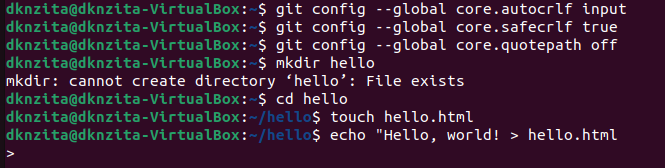{#fig:002 width=70%}

## Внесение изменений

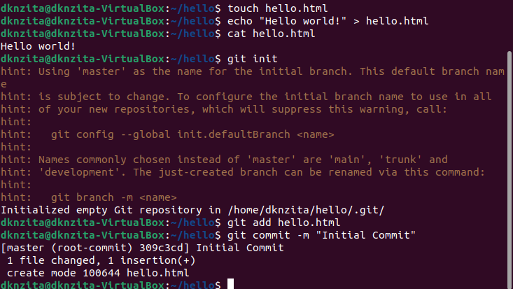{#fig:003 width=70%}

## Внесение изменений

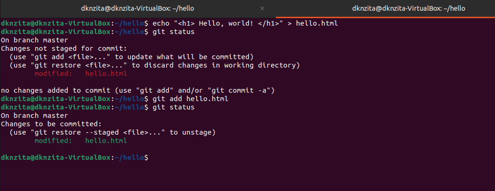{#fig:004 width=50%}

## История

{#fig:005 width=50%}

## Получение старых версий

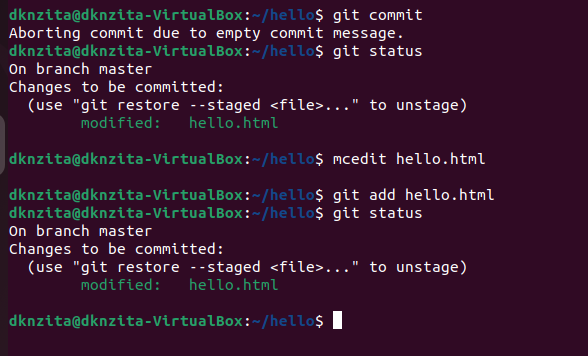{#fig:006 width=70%}

## Создание тегов версий

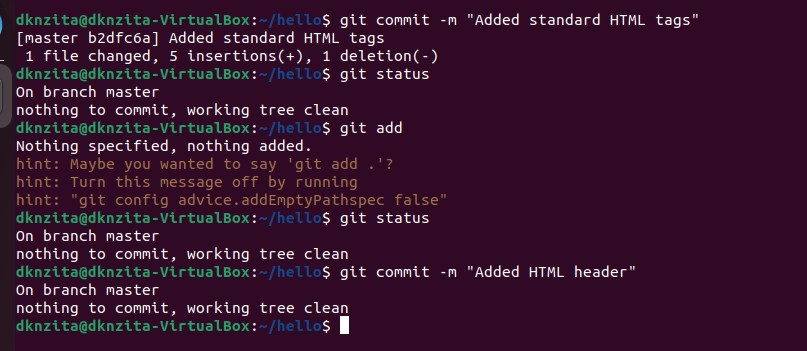{#fig:007 width=70%}

## Создание тегов версий

{#fig:008 width=70%}

## Отмена локальных изменений (до индексации)

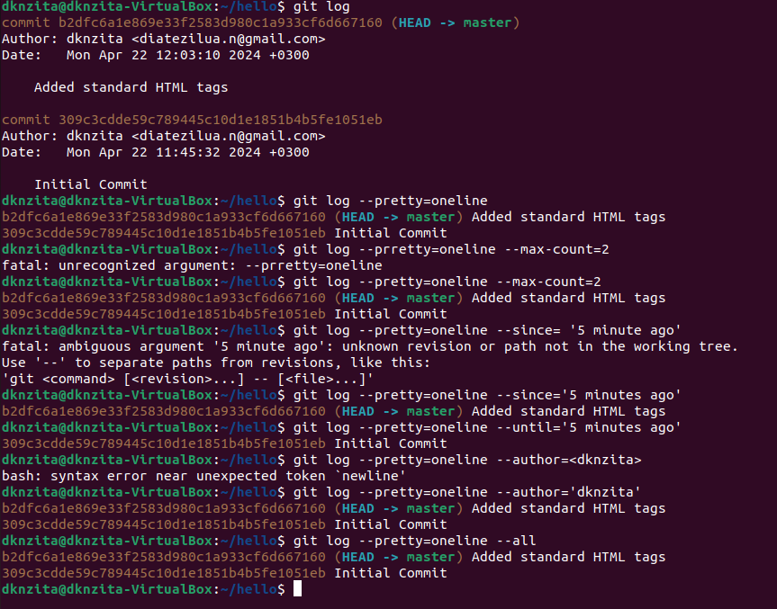{#fig:009 width=70%}

## Отмена проиндексированных изменений (перед коммитом)

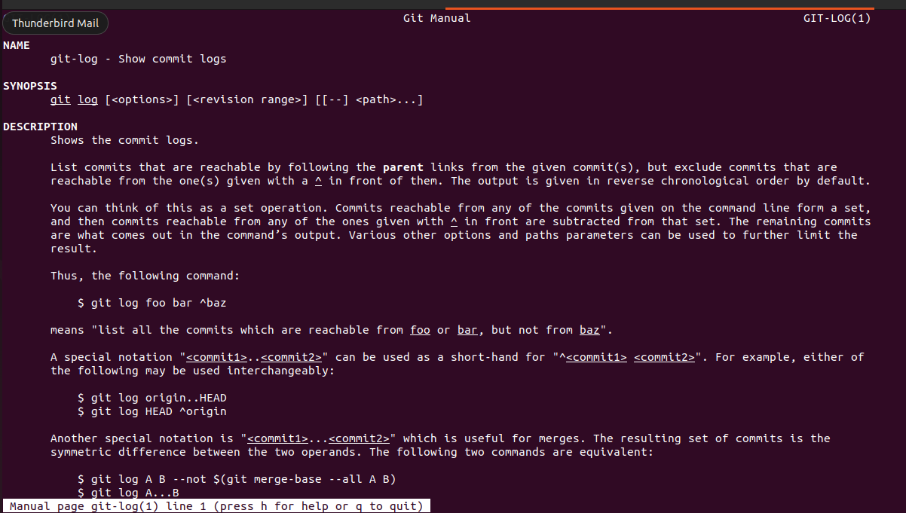{#fig:010 width=70%}

## Отмена коммитов

{#fig:011 width=70%}

## Удаление коммиттов из ветки

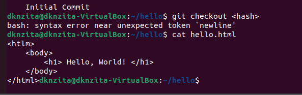{#fig:012 width=40%}

## Удаление тега oops

{#fig:013 width=70%}

## Изменение предыдущего коммита

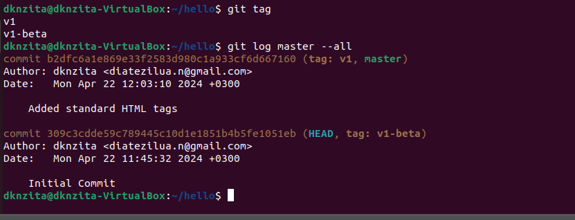{#fig:014 width=50%}

## Перемещение файлов

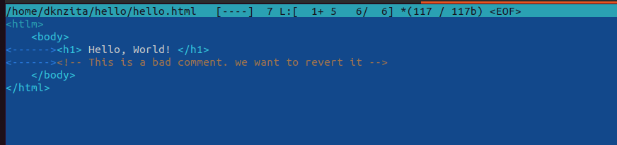{#fig:015 width=70%}

## Подробнее о структуре

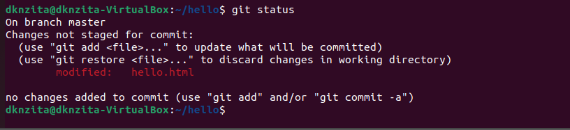{#fig:016 width=70%}

## Подробнее о структуре

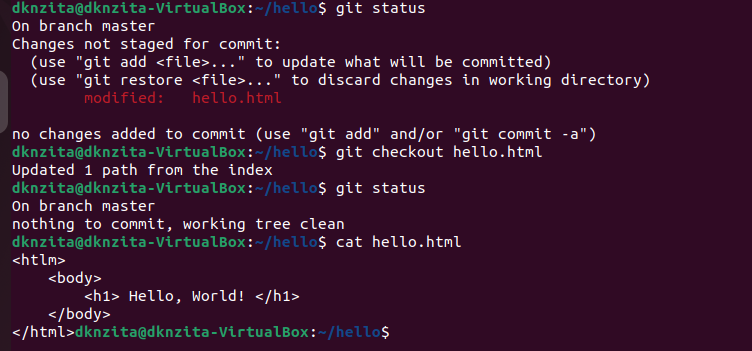{#fig:017 width=70%}

## Git внутри: Каталог .git

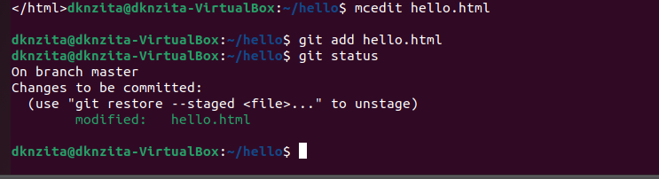{#fig:018 width=70%}

## Работа непосредственно с объектами git

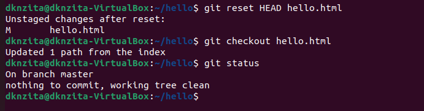{#fig:019 width=70%}

## Работа непосредственно с объектами git

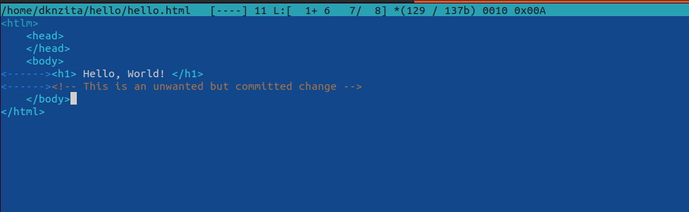{#fig:020 width=50%}

## Создание ветки

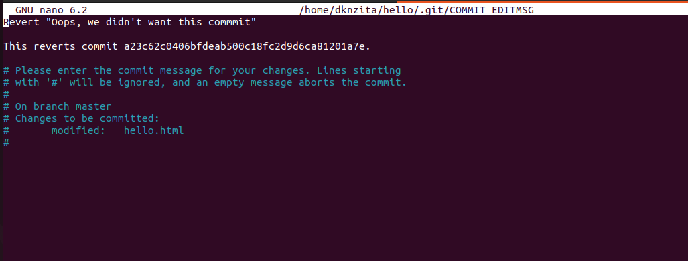{#fig:021 width=40%}

## Навигация по веткам

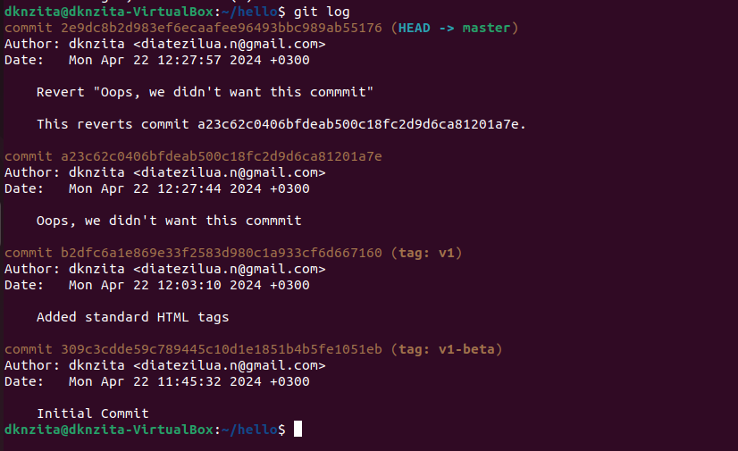{#fig:022 width=40%}

## Навигация по веткам

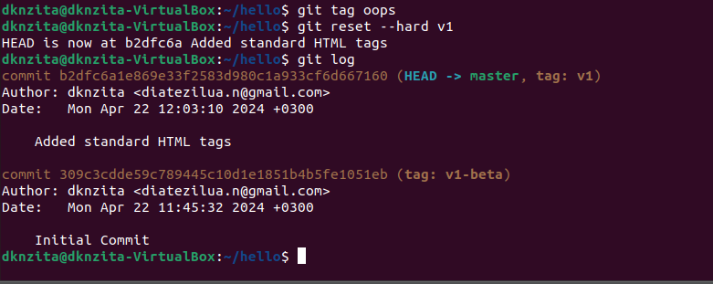{#fig:023 width=70%}

## Изменения в ветке master

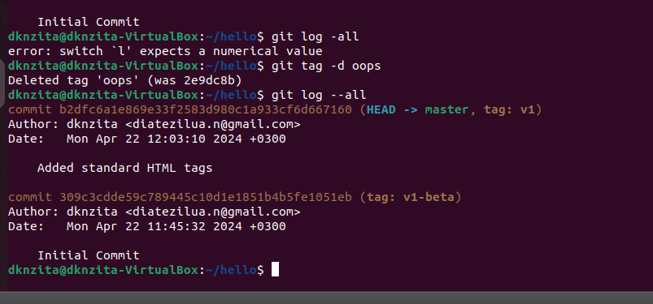{#fig:024 width=70%}

## Изменения в ветке master

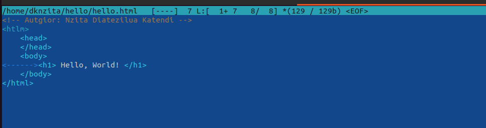{#fig:025 width=40%}

## Слияние

{#fig:026 width=40%}

## Создание конфликта

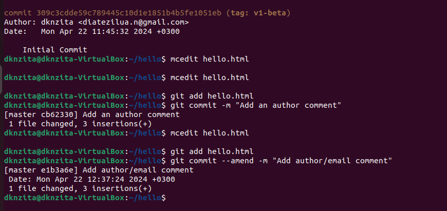{#fig:027 width=50%}

## Разрешение конфликтов

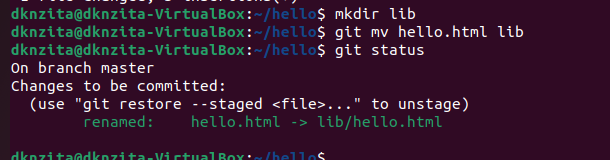{#fig:028 width=50%}

## Сброс ветки style

{#fig:029 width=50%}

## Сброс ветки style

{#fig:030 width=50%}

## Сброс ветки master

{#fig:033 width=50%}

## Сброс ветки master

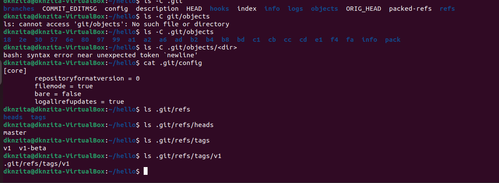{#fig:032 width=50%}

## Перебазирование

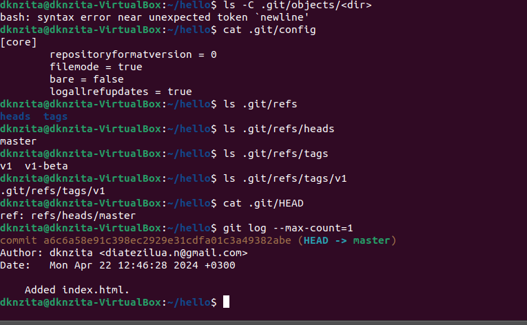{#fig:033 width=50%}

## Слияние в ветку master

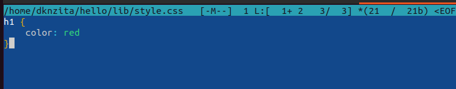{#fig:034 width=50%}

## Клонирование репозиториев

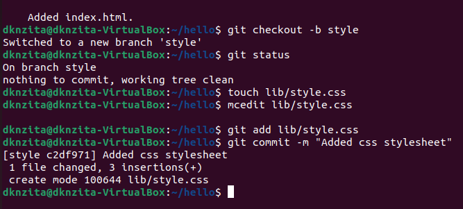{#fig:035 width=40%}

## Что такое origin?

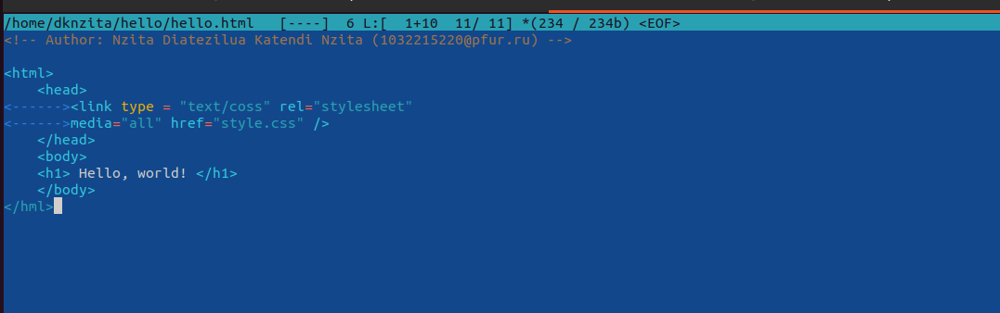{#fig:036 width=50%}

## Удаленные ветки

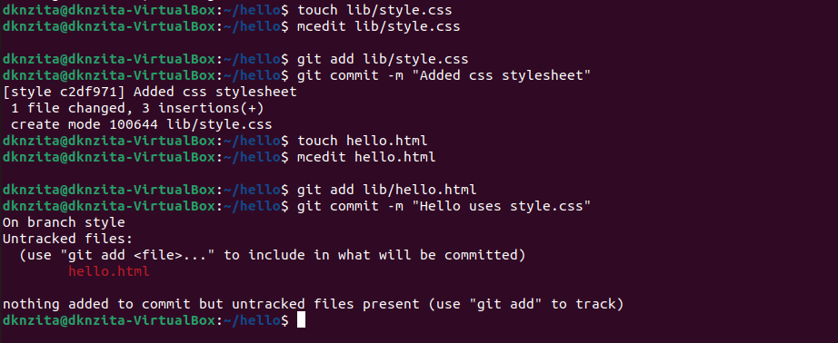{#fig:037 width=70%}

## Изменение оригинального репозитория

{#fig:038 width=70%}

## Изменение оригинального репозитория

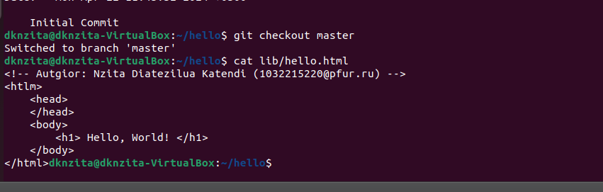{#fig:039 width=70%}

## Слияние извлеченных изменений

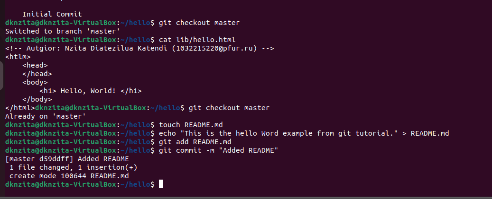{#fig:040 width=70%}

## Добавление ветки наблюдения

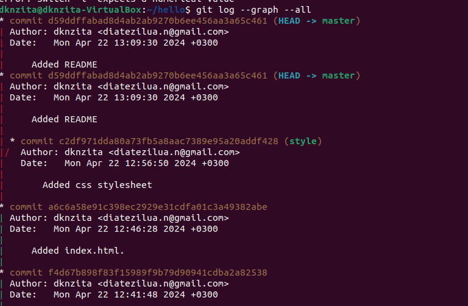{#fig:041 width=40%}

## Создание чистого репозитория

{#fig:042 width=70%}

## Отправка и извлечение изменений 

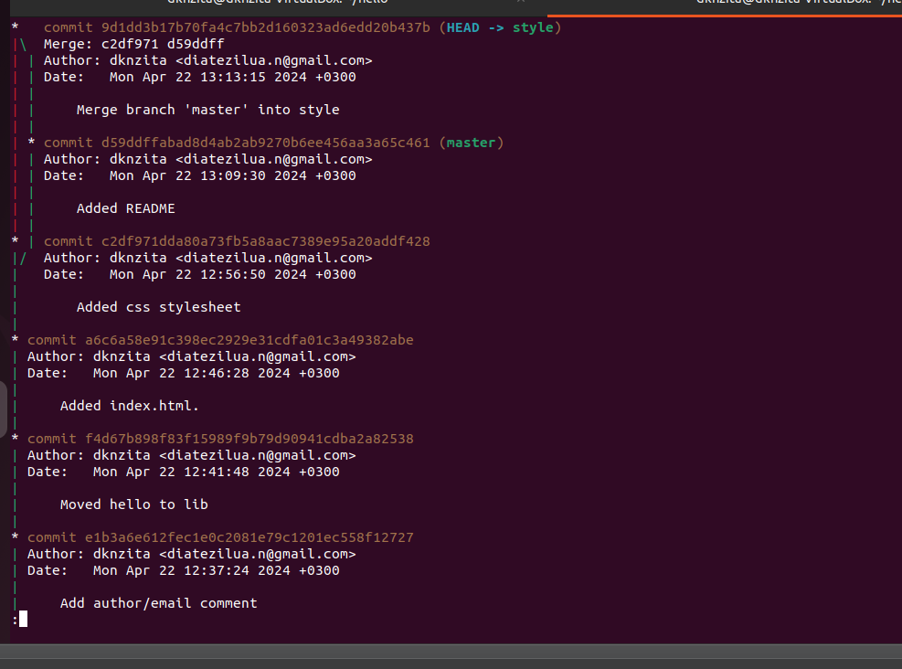{#fig:043 width=40%}

# Выводы

В результаты выполнение лабораторной работы были приобретены практические навыки работы с ситемой управления версиями Git.

# Список литературы

1. Git [Электронный ресурс]. Wikimedia Foundation, Inc., 2024. URL: https: //ru.wikipedia.org/wiki/Git.
2. GitHub [Электронный ресурс]. GitHub, Inc., 2024. URL: https://github.com/.

