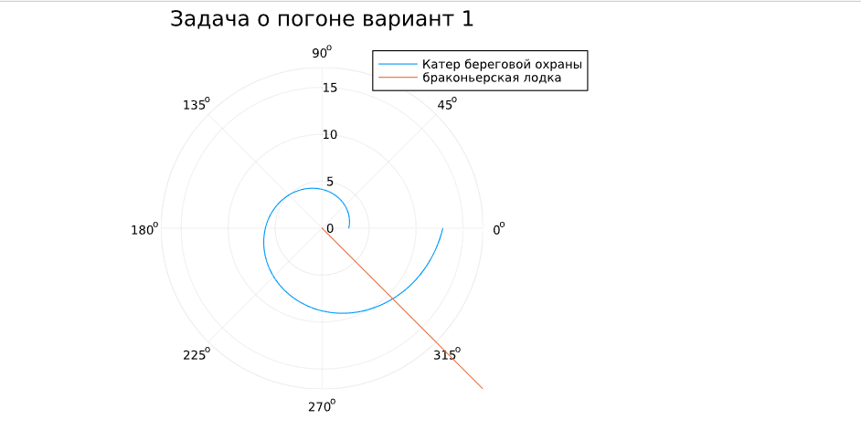
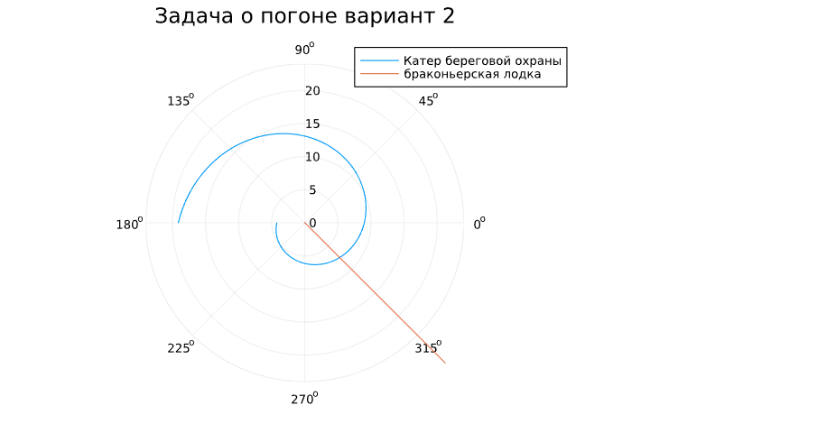
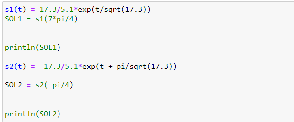

---
# Front matter
lang: ru-RU
title: "Отчет по Лабораторной Работе № 2"
subtitle: "Задача о погоне - Вариант 51"
author: "Нзита Диатезилуа Катенди"

# Formatting
toc-title: "Содержание"
toc: true # Table of contents
toc_depth: 2
lof: true # List of figures
fontsize: 12pt
linestretch: 1.5
papersize: a4paper
documentclass: scrreprt
polyglossia-lang: russian
polyglossia-otherlangs: english
mainfont: PT Serif
romanfont: PT Serif
sansfont: PT Sans
monofont: PT Mono
mainfontoptions: Ligatures=TeX
romanfontoptions: Ligatures=TeX
sansfontoptions: Ligatures=TeX,Scale=MatchLowercase
monofontoptions: Scale=MatchLowercase
indent: true
pdf-engine: lualatex
header-includes:
  - \linepenalty=10 # the penalty added to the badness of each line within a paragraph (no associated penalty node) Increasing the υalue makes tex try to haυe fewer lines in the paragraph.
  - \interlinepenalty=0 # υalue of the penalty (node) added after each line of a paragraph.
  - \hyphenpenalty=50 # the penalty for line breaking at an automatically inserted hyphen
  - \exhyphenpenalty=50 # the penalty for line breaking at an explicit hyphen
  - \binoppenalty=700 # the penalty for breaking a line at a binary operator
  - \relpenalty=500 # the penalty for breaking a line at a relation
  - \clubpenalty=150 # extra penalty for breaking after first line of a paragraph
  - \widowpenalty=150 # extra penalty for breaking before last line of a paragraph
  - \displaywidowpenalty=50 # extra penalty for breaking before last line before a display math
  - \brokenpenalty=100 # extra penalty for page breaking after a hyphenated line
  - \predisplaypenalty=10000 # penalty for breaking before a display
  - \postdisplaypenalty=0 # penalty for breaking after a display
  - \floatingpenalty = 20000 # penalty for splitting an insertion (can only be split footnote in standard LaTeX)
  - \raggedbottom # or \flushbottom
  - \usepackage{float} # keep figures where there are in the text
  - \floatplacement{figure}{H} # keep figures where there are in the text
---

---

# Цель работы

* Познакомиться с языком программирования julia
* Разобраться и научиться решать задачу о погоне, 
поставленную да винчи для выбора правильной стратегии при решении задач поиска
  
---

# Теоретическое введение

Кривая погони — кривая, представляющая собой решение задачи о «погоне», которая ставится следующим образом. Пусть точка A равномерно движется по некоторой 
заданной кривой. Требуется найти траекторию равномерного движения точки P  такую, что касательная, проведённая к траектории в любой момент движения, 
проходила бы через соответствующее этому моменту положение точки A.

Задача построения кривой погони впервые встала при выборе курса судна с учётом внешних факторов (боковых ветров, течения) 
для оптимального достижения точки цели путешествия. Вновь эта проблема возникла при использовании в военных целях подводных лодок, 
торпед, а позднее и управляемых ракет с целью достижения и поражения движущихся целей. Кроме того, кривая погони применяется в космической навигации. 

---

# Постановка задачи

На море в тумане катер береговой охраны преследует лодку браконьеров.
Через определенный промежуток времени туман рассеивается, и лодка
обнаруживается на расстоянии 17,3 км от катера. Затем лодка снова скрывается в
тумане и уходит прямолинейно в неизвестном направлении. Известно, что скорость
катера в 5,1 раза больше скорости браконьерской лодки.

---

# Задание 

1. Запишите уравнение, описывающее движение катера, с начальными
условиями для двух случаев (в зависимости от расположения катера
относительно лодки в начальный момент времени).
2. Постройте траекторию движения катера и лодки для двух случаев.
3. Найдите точку пересечения траектории катера и лодки 
   
---
# Выполнение лабораторной работы

## Теоретическая часть

Возьмем в качестве начальной точки О, точку обнаружение лодки, ввёдём полярные координаты и как полюс возьмём точку O, полярная ось будет проходить через катер в момент обнаружения лодки. Тогда есть 2 варианта развития событий:

* Катер будет справа от лодки, тогда угол тета равен 0
* Катер будет слева от лодки, тогда угол тета равен -pi

Чтобы посчитать начальное положение катера, пусть за время t катер и лодка окажутся на одном расстоянииx от полюса. За это время лодка пройдетx , а катер k - x (или k + x , в зависимости от начального положения катера относительно полюса). 
Время, за которое они пройдут это расстояние, вычисляется как

 t = x/v и t = (k - x)/5.1v 

(во втором случае (t = x + k) /5.1v). 

Так как время одно и то же, то эти величины одинаковы

Тогда неизвестное расстояниеx можно найти из следующего уравнения:
* x/v = (k - x) / 5.1v
в первом случае или
* x/v = (k + x) / 5.1v
во втором.
Отсюда мы найдем два значения

* x1 = k/5.1 = 25/5.1
* x2 = k/5.1 = 25/5.1
Задачу будем решать для двух случаев.

Т.к. после этого, катер начнет двигаться по спирали, разложим его скорость на тангенциальную и радиальную.
* Тангенциальная скорость vt = sqrt((5.1v)^2 - v^2) = sqrt(25.01)v т.к. радиальная равна v, чтобы выполнялось условие задачи.

Получаем уравнение r * dθ/dt = vt = sqrt(25.01)v.

Тогда решение исходной задачи сводится к решению системы:

{ dr/dt = v
{ r*dθ/dt = sqrt(25.01) * v

с начальными условиями
{ θ = 0           { θ = -pi
{ x = x1    или   { x = x2

Исключая производную по t можно выразить dr = dθ * r/sqrt(25.01)

## Практическая часть

Написали код на ЯП Julia, использую библиотеки Plots и DifferentialEquations. (рис. 1)

{ #fig:004 width=70% height=70% }

Получили график траектории катера и лодки для первого случая. (рис. 2)

{ #fig:004 width=70% height=70% }

Получили график траектории катера и лодки для второго случая. (рис. 3)

{ #fig:004 width=70% height=70% }

Выбрали в процессе программирования угол 3pi/4, т.к. использовали тангенс для построения графика.
Выберем для первого варианта угол 7pi/4, а для второго -pi/4.

Рассчитали точки пересечения траекторий для обоих случаев. (рис. 4)

{ #fig:004 width=70% height=70% }

Проверили вычисления с помощью Julia. (рис. 4)

{ #fig:004 width=70% height=70% }

---

# Выводы
Познакомились с ЯП julia и расмотрели задачу о погоне на примере задачи о катере береговой охраны и браконьерской лодке, а также разобрались в ней.

---

# Список литературы
[Задача о погоне](https://esystem.rudn.ru/mod/resource/view.php?id=1100252)
