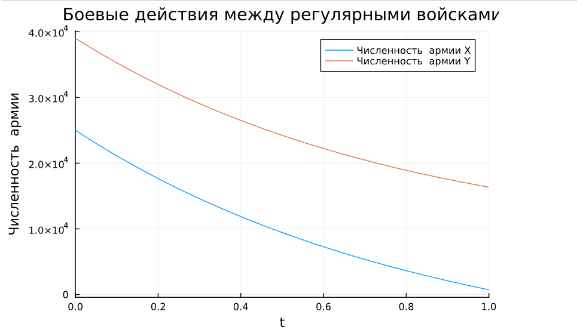

## Front matter
lang: ru-RU
title: 
        Лабораторная работа 3
subtitle: . Модель боевых действий- Вариант 51
author: Нзита Диатезилуа Категди
institute: RUDN University, Moscow, Russian Federation
date: April 13^th 2024


# Formatting
toc-title: "Содержание"
toc: true # Table of contents
toc_depth: 2
lof: true # List of figures
fontsize: 12pt
linestretch: 1.5
papersize: a4paper
documentclass: scrreprt
polyglossia-lang: russian
polyglossia-otherlangs: english
mainfont: PT Serif
romanfont: PT Serif
sansfont: PT Sans
monofont: PT Mono
mainfontoptions: Ligatures=TeX
romanfontoptions: Ligatures=TeX
sansfontoptions: Ligatures=TeX,Scale=MatchLowercase
monofontoptions: Scale=MatchLowercase
indent: true
pdf-engine: lualatex
header-includes:
  - \linepenalty=10 # the penalty added to the badness of each line within a paragraph (no associated penalty node) Increasing the υalue makes tex try to haυe fewer lines in the paragraph.
  - \interlinepenalty=0 # υalue of the penalty (node) added after each line of a paragraph.
  - \hyphenpenalty=50 # the penalty for line breaking at an automatically inserted hyphen
  - \exhyphenpenalty=50 # the penalty for line breaking at an explicit hyphen
  - \binoppenalty=700 # the penalty for breaking a line at a binary operator
  - \relpenalty=500 # the penalty for breaking a line at a relation
  - \clubpenalty=150 # extra penalty for breaking after first line of a paragraph
  - \widowpenalty=150 # extra penalty for breaking before last line of a paragraph
  - \displaywidowpenalty=50 # extra penalty for breaking before last line before a display math
  - \brokenpenalty=100 # extra penalty for page breaking after a hyphenated line
  - \predisplaypenalty=10000 # penalty for breaking before a display
  - \postdisplaypenalty=0 # penalty for breaking after a display
  - \floatingpenalty = 20000 # penalty for splitting an insertion (can only be split footnote in standard LaTeX)
  - \raggedbottom # or \flushbottom
  - \usepackage{float} # keep figures where there are in the text
  - \floatplacement{figure}{H} # keep figures where there are in the text
---

# Цель работы

Рассмотрим некоторые простейшие модели боевых действий – модели
Ланчестера. В противоборстве могут принимать участие как регулярные войска,
так и партизанские отряды. В общем случае главной характеристикой соперников
являются численности сторон. Если в какой-то момент времени одна из
численностей обращается в нуль, то данная сторона считается проигравшей (при
условии, что численность другой стороны в данный момент положительна).

# Задание
Между страной Х и страной У идет война. Численность состава войск исчисляется от начала войны, и являются временными функциями xt( ) и yt( ). В начальный момент времени страна Х имеет армию численностью 25 000 человек, а в распоряжении страны У армия численностью в 39 000 человек. Для упрощения модели считаем, что коэффициенты a, b, c, h  постоянны. Также считаем P(t) и Q(t) непрерывные функции.

Постройте графики изменения численности войск армии Х и армии У для следующих случаев:
1. Модель боевых действий между регулярными войсками

  dx/dt = -0.441x(t) - 0,773y(t) + sin(2t) + 1
  dy/dt = -0,55x(t) - 0,664y(t) + cos(2t) + 1

2. Модель ведение боевых действий с участием регулярных войск и партизанских отрядов
    dx/dt = -0.399x(t) - 0.688y(t) + sin(2t) + 2
    dy/dt = -0.299x(t)y(t) - 0.811y(t) + cos(3t) + 1

# Выполнение лабораторной работы

Рассмотри три случая ведения боевых действий:
1. Боевые действия между регулярными войсками
2. Боевые действия с участием регулярных войск и партизанских отрядов 

В этом случае модель боевых действий между регулярными войсками
описывается следующим образом
dx/dt = -a(t)x(t) - b(t)y(t) + P(t)
dx/dt = -c(t)x(t) - h(t)y(t) + Q(t)

Во втором случае в борьбу добавляются партизанские отряды. Нерегулярные войска в отличии от постоянной армии менее уязвимы, так как действуют скрытно, в этом случае сопернику приходится действовать неизбирательно, по площадям, занимаемым партизанами. Поэтому считается, что тем потерь партизан, проводящих свои операции в разных местах на некоторой известной территории, пропорционален не только численности армейских соединений, но и   исленности самих партизан. В результате модель принимает вид:

dx/dt = -a(t)x(t) - b(t)y(t) + P(t)
dx/dt = -c(t)x(t)y(t) - h(t)y(t) + Q(t)
 
## Условие задачи

#начальные условия
x0 = 25000;       # численность первой армии
y0 = 39000;       #численность второй армии
t0 = 0;           #начальный момент времени
a = 0.441;        #константа, характеризующая степень влияния различных
#факторов на потери
b = 0.773;      #эффективность боевых действий армии у
c = 0.55;      #эффективность боевых действий армии х
h = 0.664;    #константа, характеризующая степень влияния различных факторов на потери

tmax = 1;  #предельный момент времени

t = (t0, tmax);


## Код программы (Julia)

```
using Plots
using OrdinaryDiffEq

#начальные условия
x0 = 25000;       #численность первой армии
y0 = 39000;       #численность второй армии
t0 = 0;           #начальный момент времени
a = 0.441;        #константа, характеризующая степень влияния различных
#факторов на потери
b = 0.773;      #эффективность боевых действий армии у
c = 0.55;      #эффективность боевых действий армии х
h = 0.664;    #константа, характеризующая степень влияния различных факторов на потери

tmax = 1;  #предельный момент времени

t = (t0, tmax);

function P(t)   #возможность подхода подкрепления к армии х
    p = sin(2*t) + 1;
end

function Q(t)  #возможность подхода подкрепления к армии у
    q = cos(2*t) + 1;
end

#Система дифференциальных уравнений
function f(du, u, p, t)
    du[1] = - a*u[1] - b*u[2] + P(t);    #изменение численности первой армии
    du[2] = - c*u[1] - h*u[2] + Q(t);     #изменение численности второй армии
end

v0 = [x0;y0];   #Вектор начальных условий

prob =  ODEProblem(f, v0, t)
sol = solve(prob, Tsit5())

plot(sol, vars =(1), label = "Численность  армии Х" , title = " Боевые действия между регулярными войсками ")
plot!(sol, vars=(2), label = "Численность  армии Y",  ylabel = "Численность  армии")

## Модель ведение боевых действий с участием регулярных войск и  партизанских отрядов

x2 = 25000;       #численность первой армии
y2 = 39000;       #численность второй армии

a2 = 0.399;        #константа, характеризующая степень влияния различных
#факторов на потери
b2 = 0.688;      #эффективность боевых действий армии у
c2 = 0.299;      #эффективность боевых действий армии х
h2 = 0.811;    #константа, характеризующая степень влияния различных факторов на потери

function P2(t)   #возможность подхода подкрепления к армии х
    p2 = sin(2*t) + 2;
end

function Q2(t)  #возможность подхода подкрепления к армии у
    q2 = cos(3*t) + 1;
end

#Система дифференциальных уравнений
function f2(du, u, p, t)
    du[1] = - a*u[1] - b*u[2] + P(t);    #изменение численности первой армии
    du[2] = - c*u[1]*u[2] - h*u[2] + Q(t);     #изменение численности второй армии
end

v2 = [x2;y2];   #Вектор начальных условий

prob2 =  ODEProblem(f2, v2, t)
sol2 = solve(prob, Tsit5())

plot(sol2, vars =(1), label = "Численность  армии Х", title = "Второй случайв")
plot!(sol2, vars=(2), label = "Численность  армии Y",  ylabel = "Численность  армии")

```

## Решение

{ #fig:002 width=70% height=70% }

{ #fig:004 width=70% height=70% }

# Выводы

В данной работе мы проанализировали простейшую модель Ланчера, где увидели, что изменение численности армии X стремится к нулю, и если задача решена, то эта сторона считается проигравшей, а y – победителем.
# Список литературы {.unnumbered}

1. [Модель боевых действий](https://esystem.rudn.ru/mod/resource/view.php?id=1100257)