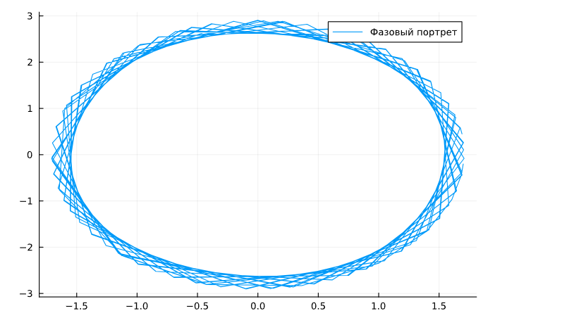
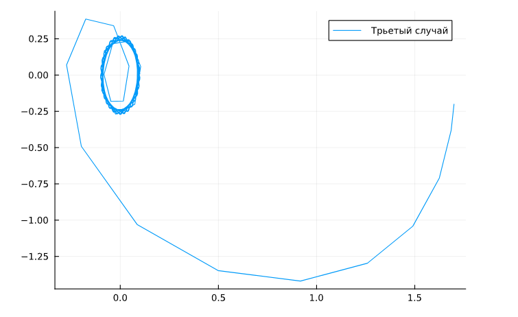

---
## Front matter
title: "Презентация по лабораторной работе №4"
subtitle: "Модель боевых действий"
author: " Нзита Диатезилуа Катенди"

## Generic otions
lang: ru-RU

## Formatting
toc: false
slide_level: 2
theme: metropolis
header-includes:
- \metroset{progressbar=frametitle,sectionpage=progressbar,numbering=fraction}
- '\makeatletter'
- '\beamer@ignorenonframefalse'
- '\makeatother'
aspectratio: 43
section-titles: true
---

# Информация

## Докладчик

:::::::::::::: {.columns align=center}
::: {.column width="70%"}

  * Нзита Диатезилуа Катенди
  * студент группы НКНбд-01-21
  * Российский университет дружбы народов
  * <https://github.com/NzitaKatendi/Math_modeling>

:::
::: {.column width="30%"}

:::
::::::::::::::
# Цели работы

Изучить понятие гармонического осциллятора, построить фвзовый портроет и найти решение уравнения гармонического осциллятора

---

# Теоретическое введение

Движение грузика на пружинке, маятника, заряда в электрическом контуре, а
также эволюция во времени многих систем в физике, химии, биологии и других
науках при определенных предположениях можно описать одним и тем же
дифференциальным уравнением, которое в теории колебаний выступает в качестве
основной модели. Эта модель называется линейным гармоническим осциллятором.
Уравнение свободных колебаний гармонического осциллятора имеет
следующий вид:

$$ddot{x} + 2\gamma\dot{x} + \omega^2{x} = 0$$

где $x$ – переменная, описывающая состояние системы (смещение грузика, заряд
конденсатора и т.д.), gamma – параметр, характеризующий потери энергии (трение в
механической системе, сопротивление в контуре), omega – собственная частота колебаний, $t – время.

---

# Постановка задачи

Вариант № 51

Постройте фазовый портрет гармонического осциллятора и решение уравнения
гармонического осциллятора для следующих случаев 

---

# Задачи

1. Колебания гармонического осциллятора без затуханий и без действий внешней
силы $$\dot{x} + 1.7x = 0 $$

2. Колебания гармонического осциллятора c затуханием и без действий внешней
силы $$\ddot{x} + 1.7\dot{x} + 1.7x = 0 $$

3. Колебания гармонического осциллятора c затуханием и под действием внешней
силы $$\ddot{x} + 2\dot{x} + 1.7x = 0.7cos(2.7t) $$
 

---

# Выполнение работы

using DifferentialEquations, Plots

# Начальные условия и параметры

tspan = (0, 59)
p1 = [0, 1.7]
p2 =  [1.7, 1.7]
p3 = [2, 1.7]

# с начальными условиями 

x0 = [1.7, -0.2]

#й внешняя сила

f(t) = 0.7*cos(2.7*t)

#Фунция колебаний без затуханий и без действий внешней

function osci_w1(dx, x, p, t)
    gamma , w = p
    dx[1] = x[2]
    dx[2] = -w .* x[1] - gamma .* x[2]
end

function osci_w2(dx, x, p, t)
    gamma , w = p
    dx[1] = x[2]
    dx[2] = -w .* x[1] - gamma .* x[2] .+ f(t)
end

#случай 1

prob1 = ODEProblem(osci_w1, x0, tspan, p1)
sol1 = solve(prob1, dtmax = 0.05)

plot(sol1)  #График колебаний
plot(sol1, vars = (2, 1))  #Фазовый портрет

---

#случай 2

prob2 = ODEProblem(osci_w1, x0, tspan, p2)
sol2 = solve(prob2, dtmax = 0.05)

plot(sol2)  #График колебаний
plot(sol2, vars = (2, 1))  #Фазовый портрет

---

#случай 3

prob3 = ODEProblem(osci_w2, x0, tspan, p3)
sol3 = solve(prob3, dtmax = 0.05)

plot(sol3)  #График колебаний
plot(sol3, vars = (2, 1))  #Фазовый портрет

---
Случай 1 (рис. 1)

{#fig:002 width=70%}

Случай 2 (рис. 2)

{#fig:002 width=70%}

Случай 2 (рис. 3)

{#fig:002 width=70%}

---

# Вывод

 Мы научились строить фазовые портреть а также изучили гармонические колебания осциллятора

---
