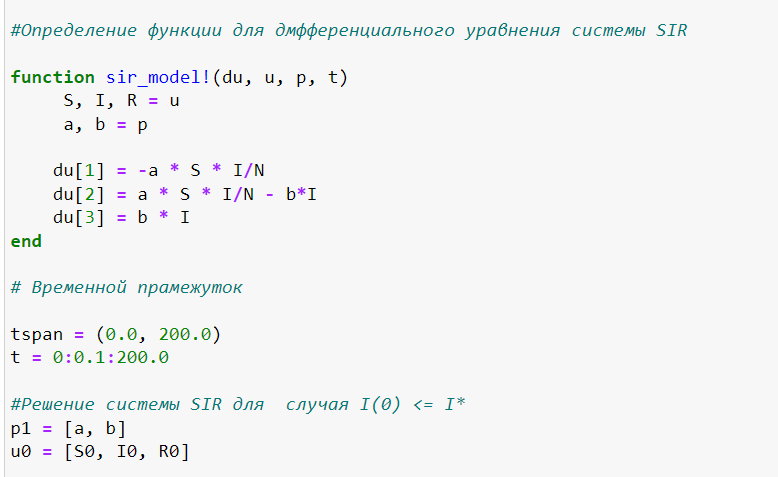
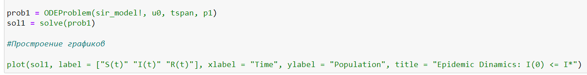
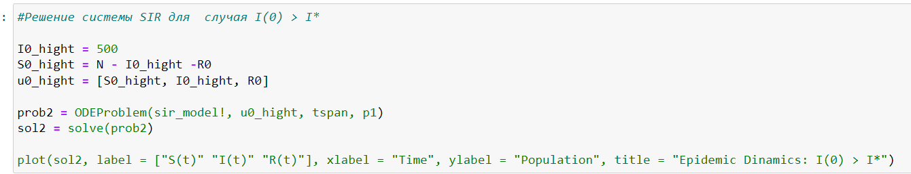
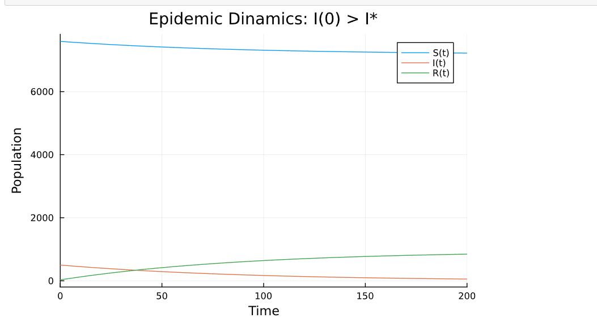

---
# Front matter
lang: ru-RU
title: "Презентации по Лабораторной Работе №6"
subtitle: " Задача об эпидемии - Вариант 51"
author: "Нзита Диатезилуа Катенди"

# Formatting
toc-title: "Содержание"
toc: true # Table of contents
toc_depth: 2
lof: true # List of figures
fontsize: 12pt
linestretch: 1.5
papersize: a4paper
documentclass: scrreprt
polyglossia-lang: russian
polyglossia-otherlangs: english
mainfont: PT Serif
romanfont: PT Serif
sansfont: PT Sans
monofont: PT Mono
mainfontoptions: Ligatures=TeX
romanfontoptions: Ligatures=TeX
sansfontoptions: Ligatures=TeX,Scale=MatchLowercase
monofontoptions: Scale=MatchLowercase
indent: true
pdf-engine: lualatex
header-includes:
  - \linepenalty=10 # the penalty added to the badness of each line within a paragraph (no associated penalty node) Increasing the υalue makes tex try to haυe fewer lines in the paragraph.
  - \interlinepenalty=0 # υalue of the penalty (node) added after each line of a paragraph.
  - \hyphenpenalty=50 # the penalty for line breaking at an automatically inserted hyphen
  - \exhyphenpenalty=50 # the penalty for line breaking at an explicit hyphen
  - \binoppenalty=700 # the penalty for breaking a line at a binary operator
  - \relpenalty=500 # the penalty for breaking a line at a relation
  - \clubpenalty=150 # extra penalty for breaking after first line of a paragraph
  - \widowpenalty=150 # extra penalty for breaking before last line of a paragraph
  - \displaywidowpenalty=50 # extra penalty for breaking before last line before a display math
  - \brokenpenalty=100 # extra penalty for page breaking after a hyphenated line
  - \predisplaypenalty=10000 # penalty for breaking before a display
  - \postdisplaypenalty=0 # penalty for breaking after a display
  - \floatingpenalty = 20000 # penalty for splitting an insertion (can only be split footnote in standard LaTeX)
  - \raggedbottom # or \flushbottom
  - \usepackage{float} # keep figures where there are in the text
  - \floatplacement{figure}{H} # keep figures where there are in the text
---

# Цель работы

Целью данной работы является решение упражнения по эпидемиям на языке программирования julia

# Задание

На одном острове вспыхнула эпидемия. Известно, что из всех проживающих на острове (N=8 124) в момент начала эпидемии (t=0) число заболевших людей (являющихся распространителями инфекции) I(0)=124, А число здоровых людей с иммунитетом к болезни R(0)=30. Таким образом, число людей восприимчивых к
болезни, но пока здоровых, в начальный момент времени S(0)=N-I(0)- R(0).

Постройте графики изменения числа особей в каждой из трех групп. 

Рассмотрите, как будет протекать эпидемия в случае: 

I(0) <= I*
I(0) > I*

# Выполнение лабораторной работы

Придумайте свой пример задачи об эпидемии, задайте начальные условия и
коэффициенты пропорциональности. Постройте графики изменения числа особей в
каждой из трех групп. Рассмотрите, как будет протекать эпидемия в случае: 

I(0) <= I*
I(0) > I*

## Условие задачи

a = 0.01   # коэффициент заболеваемости
b = 0.02   #коэффициент выздоровления
N = 8124  # общая численность популяции
I0 = 124   # количество инфицированных особей в начальный момент времени
R0 = 30         #количество здоровых особей с иммунитетом в начальный момент времени
S0 = N - I0 - R0 # количество восприимчивых к болезни особей в начальный момент времени

## Решение

{ #fig:002 width=70% height=70% }

{ #fig:004 width=70% height=70% }

{ #fig:004 width=70% height=70% }

{ #fig:004 width=70% height=70% }

{ #fig:004 width=70% height=70% }

# Выводы

Можно сделать вывод, что с помощью языка программирования Julia, мы решили задание об эпидемиями а также построили график показываюший динамику изменения чисенности людей в каждой трех групп в случае I(0) <= I*  и I(0) > I*.

# Список литературы {.unnumbered}

1. [Задача об эпидемии](https://esystem.rudn.ru/mod/resource/view.php?id=1100268)