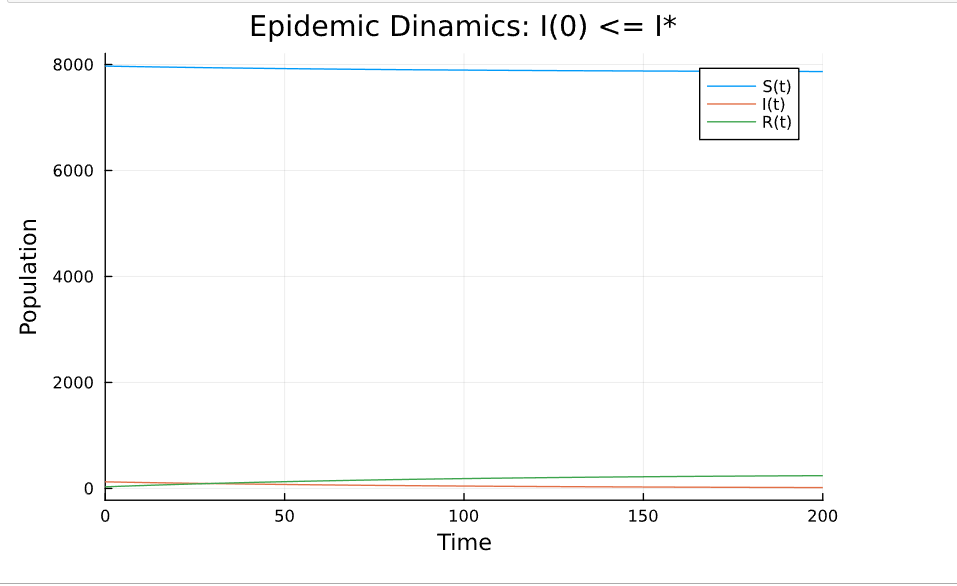

---
# Front matter
lang: ru-RU
title: "Отчет по Лабораторной Работе №6"
subtitle: "Задача об эпидемии - Вариант 51"
author: "Нзита Диатезилуа Катенди"

# Formatting
toc-title: "Содержание"
toc: true # Table of contents
toc_depth: 2
lof: true # List of figures
fontsize: 12pt
linestretch: 1.5
papersize: a4paper
documentclass: scrreprt
polyglossia-lang: russian
polyglossia-otherlangs: english
mainfont: PT Serif
romanfont: PT Serif
sansfont: PT Sans
monofont: PT Mono
mainfontoptions: Ligatures=TeX
romanfontoptions: Ligatures=TeX
sansfontoptions: Ligatures=TeX,Scale=MatchLowercase
monofontoptions: Scale=MatchLowercase
indent: true
pdf-engine: lualatex
header-includes:
  - \linepenalty=10 # the penalty added to the badness of each line within a paragraph (no associated penalty node) Increasing the υalue makes tex try to haυe fewer lines in the paragraph.
  - \interlinepenalty=0 # υalue of the penalty (node) added after each line of a paragraph.
  - \hyphenpenalty=50 # the penalty for line breaking at an automatically inserted hyphen
  - \exhyphenpenalty=50 # the penalty for line breaking at an explicit hyphen
  - \binoppenalty=700 # the penalty for breaking a line at a binary operator
  - \relpenalty=500 # the penalty for breaking a line at a relation
  - \clubpenalty=150 # extra penalty for breaking after first line of a paragraph
  - \widowpenalty=150 # extra penalty for breaking before last line of a paragraph
  - \displaywidowpenalty=50 # extra penalty for breaking before last line before a display math
  - \brokenpenalty=100 # extra penalty for page breaking after a hyphenated line
  - \predisplaypenalty=10000 # penalty for breaking before a display
  - \postdisplaypenalty=0 # penalty for breaking after a display
  - \floatingpenalty = 20000 # penalty for splitting an insertion (can only be split footnote in standard LaTeX)
  - \raggedbottom # or \flushbottom
  - \usepackage{float} # keep figures where there are in the text
  - \floatplacement{figure}{H} # keep figures where there are in the text
---

# Цель работы

Целью данной работы является решение упражнения по эпидемиям на языке программирования julia.

# Задание

На одном острове вспыхнула эпидемия. Известно, что из всех проживающих на острове (N=8 124) в момент начала эпидемии (t=0) число заболевших людей (являющихся распространителями инфекции) I(0)=124, А число здоровых людей с иммунитетом к болезни R(0)=30. Таким образом, число людей восприимчивых к болезни, но пока здоровых, в начальный момент времени S(0)=N-I(0)- R(0).

Постройте графики изменения числа особей в каждой из трех групп. 

# Выполнение лабораторной работы

Рассмотрим простейшую модель эпидемии. Предположим, что некая популяция, состоящая из N особей, (считаем, что популяция изолирована) подразделяется на три группы. Первая группа - это восприимчивые к болезни, но пока здоровые особи, обозначим их через S(t). Вторая группа – это число инфицированных особей, которые также при этом являются распространителями инфекции, обозначим их I(t). А третья группа, обозначающаяся через R(t) – это здоровые особи с иммунитетом к болезни

До того, как число заболевших не превышает критического значения
I(t) > I*, считаем, что все больные изолированы и не заражают здоровых. Когда
тогда инфицирование способны заражать восприимчивых к болезни особей.

Таким образом, скорость изменения числа S(t) меняется по следующему
закону:

dS/dt = {
    -a*S, если I(t) > I*
    0, если I(t) <= I*
}

Поскольку каждая восприимчивая к болезни особь, которая, в конце концов,
заболевает, сама становится инфекционной, то скорость изменения числа инфекционных особей представляет разность за единицу времени между заразившимися и теми, кто уже болеет и лечится, т.е.:

dS/dt = {
         a*S - b*I если I(t)  > I*
        -b*I  если I(t) <= I*
}

А скорость изменения выздоравливающих особей (при этом приобретающие
иммунитет к болезни)
 
 dR/dt = b*I

Постоянные пропорциональности
 , - это коэффициенты заболеваемости
и выздоровления соответственно.

## Условие задачи
Придумайте свой пример задачи об эпидемии, задайте начальные условия и коэффициенты пропорциональности. Постройте графики изменения числа особей в каждой из трех групп. Рассмотрите, как будет протекать эпидемия в случае:

# Первый случай
I(O) <= I*
# Второй случай
I(0) > I*

## Код программы (Julia)

using DifferentialEquations
using Plots

a = 0.01   # коэффициент заболеваемости
b = 0.02   #коэффициент выздоровления
N = 8124  # общая численность популяции
I0 = 124   # количество инфицированных особей в начальный момент времени
R0 = 30         #количество здоровых особей с иммунитетом в начальный момент времени
S0 = N - I0 - R0 # количество восприимчивых к болезни особей в начальный момент времени

#Определение функции для дмфференциального уравнения системы SIR

function sir_model!(du, u, p, t)
     S, I, R = u
     a, b = p
    
    du[1] = -a * S * I/N
    du[2] = a * S * I/N - b*I
    du[3] = b * I
end

# Временной прамежуток

tspan = (0.0, 200.0)
t = 0:0.1:200.0

# Первый случай

#Решение системы SIR для  случая I(0) <= I*
p1 = [a, b]
u0 = [S0, I0, R0]

prob1 = ODEProblem(sir_model!, u0, tspan, p1)
sol1 = solve(prob1)

#Простроение графиков

plot(sol1, label = ["S(t)" "I(t)" "R(t)"], xlabel = "Time", ylabel = "Population", title = "Epidemic Dinamics: I(0) <= I*")

# Второй случай

#Решение системы SIR для  случая I(0) > I*

I0_hight = 500
S0_hight = N - I0_hight -R0
u0_hight = [S0_hight, I0_hight, R0]

prob2 = ODEProblem(sir_model!, u0_hight, tspan, p1)
sol2 = solve(prob2)

plot(sol2, label = ["S(t)" "I(t)" "R(t)"], xlabel = "Time", ylabel = "Population", title = "Epidemic Dinamics: I(0) > I*")

## Решение

{ #fig:002 width=70% height=70% }

{ #fig:004 width=70% height=70% }

# Выводы

 Можно сделать вывод, что с помощью языка программирования Julia,мы решили задане об опидемиями а также построили график показываюцший дикамику изменения численности людей в каждой трех групп в cлучае I(0) <= I*  и I(0)> I*.

# Список литературы {.unnumbered}

1. [Задача об эпидемии](https://esystem.rudn.ru/mod/resource/view.php?id=1100268)
