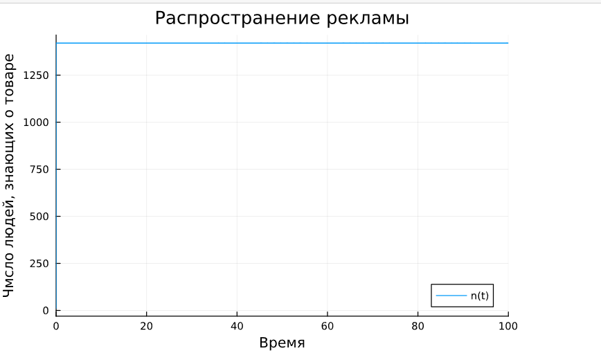

---
# Front matter
lang: ru-RU
title: "Презентации по Лабораторной Работе № 7"
subtitle: " Эффективность рекламы - Вариант 51"
author: "Нзита Диатезилуа Катенди"
email: 1032215220@pfur.ru
adress: https://github.com/NzitaKatendi/Mathematical-modality/tree/main/Labs/Lab07

# Formatting
toc-title: "Содержание"
toc: true # Table of contents
toc_depth: 2
lof: true # List of figures
fontsize: 12pt
linestretch: 1.5
papersize: a4paper
documentclass: scrreprt
polyglossia-lang: russian
polyglossia-otherlangs: english
mainfont: PT Serif
romanfont: PT Serif
sansfont: PT Sans
monofont: PT Mono
mainfontoptions: Ligatures=TeX
romanfontoptions: Ligatures=TeX
sansfontoptions: Ligatures=TeX,Scale=MatchLowercase
monofontoptions: Scale=MatchLowercase
indent: true
pdf-engine: lualatex
header-includes:
  - \linepenalty=10 # the penalty added to the badness of each line within a paragraph (no associated penalty node) Increasing the υalue makes tex try to haυe fewer lines in the paragraph.
  - \interlinepenalty=0 # υalue of the penalty (node) added after each line of a paragraph.
  - \hyphenpenalty=50 # the penalty for line breaking at an automatically inserted hyphen
  - \exhyphenpenalty=50 # the penalty for line breaking at an explicit hyphen
  - \binoppenalty=700 # the penalty for breaking a line at a binary operator
  - \relpenalty=500 # the penalty for breaking a line at a relation
  - \clubpenalty=150 # extra penalty for breaking after first line of a paragraph
  - \widowpenalty=150 # extra penalty for breaking before last line of a paragraph
  - \displaywidowpenalty=50 # extra penalty for breaking before last line before a display math
  - \brokenpenalty=100 # extra penalty for page breaking after a hyphenated line
  - \predisplaypenalty=10000 # penalty for breaking before a display
  - \postdisplaypenalty=0 # penalty for breaking after a display
  - \floatingpenalty = 20000 # penalty for splitting an insertion (can only be split footnote in standard LaTeX)
  - \raggedbottom # or \flushbottom
  - \usepackage{float} # keep figures where there are in the text
  - \floatplacement{figure}{H} # keep figures where there are in the text
---

# Цель работы

Целью данной работы является решение упражнения по эффектиыности  реклами на языке программирования Julia.

# Задание

Постройте график распространения рекламы, математическая модель которой описывается следующим уравнением:

dn/dt = (0.7 + 0.000012n(t))(N - n(t))
dn/dt = (0.00003 + 0.5n(t))(N - n(t))
dn/dt = (0.57sin(t) + 0.38cos(t))(N - n(t))

## Условие задачи

a1 = 0.7
a2 = 0.000012
N = 1420

## Решение

{ #fig:002 width=70% height=70% }

{ #fig:004 width=70% height=70% }

{ #fig:004 width=70% height=70% }

{ #fig:004 width=70% height=70% }

{ #fig:004 width=70% height=70% }

{ #fig:004 width=70% height=70% }

{ #fig:004 width=70% height=70% }

{ #fig:004 width=70% height=70% }

# Выводы

Сделан вывод что с помощью языка программирования Julia  удалось решить задачу связанную с эффективностью рекламы где мы увидели три ситуации и смогли постоить график распространения информации о товаре приняв их во вниманиет. Платная реклама и с учетом сарафанного радио.

# Список литературы {.unnumbered}

1. [Эффективность рекламы](https://esystem.rudn.ru/mod/resource/view.php?id=1100272)