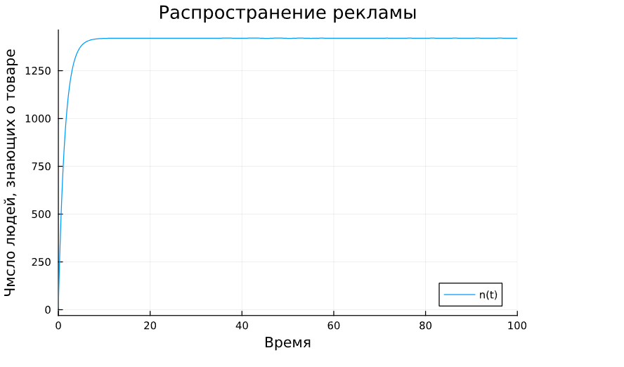
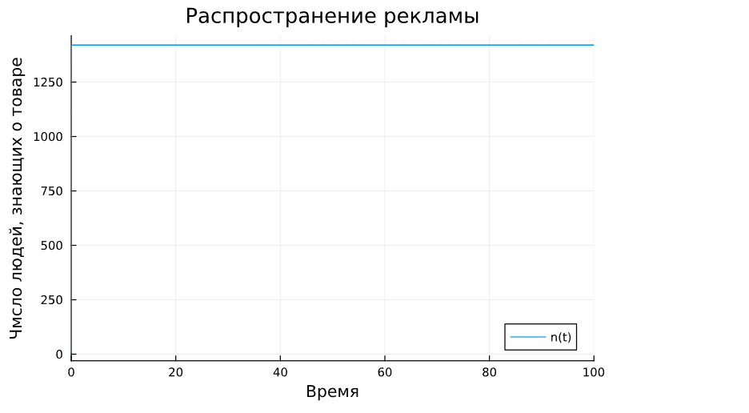
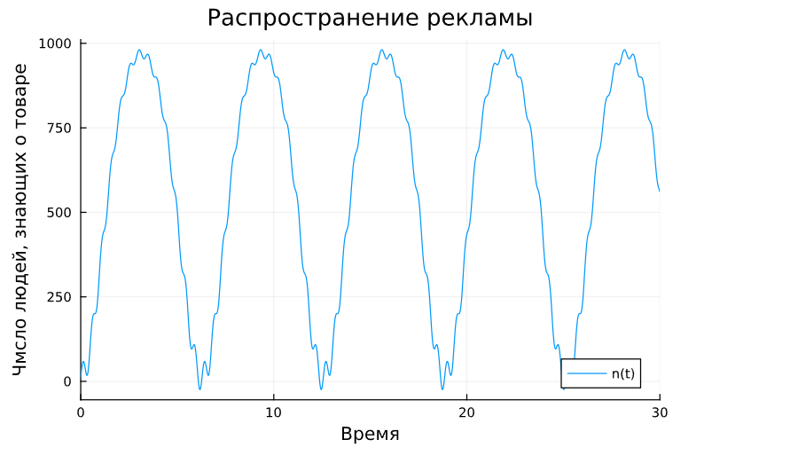

---
# Front matter
lang: ru-RU
title: "Отчет по Лабораторной Работе № 7"
subtitle: " Эффективность рекламы  - Вариант 51"
author: "Нзита Диатезилуа Катенди"

# Formatting
toc-title: "Содержание"
toc: true # Table of contents
toc_depth: 2
lof: true # List of figures
fontsize: 12pt
linestretch: 1.5
papersize: a4paper
documentclass: scrreprt
polyglossia-lang: russian
polyglossia-otherlangs: english
mainfont: PT Serif
romanfont: PT Serif
sansfont: PT Sans
monofont: PT Mono
mainfontoptions: Ligatures=TeX
romanfontoptions: Ligatures=TeX
sansfontoptions: Ligatures=TeX,Scale=MatchLowercase
monofontoptions: Scale=MatchLowercase
indent: true
pdf-engine: lualatex
header-includes:
  - \linepenalty=10 # the penalty added to the badness of each line within a paragraph (no associated penalty node) Increasing the υalue makes tex try to haυe fewer lines in the paragraph.
  - \interlinepenalty=0 # υalue of the penalty (node) added after each line of a paragraph.
  - \hyphenpenalty=50 # the penalty for line breaking at an automatically inserted hyphen
  - \exhyphenpenalty=50 # the penalty for line breaking at an explicit hyphen
  - \binoppenalty=700 # the penalty for breaking a line at a binary operator
  - \relpenalty=500 # the penalty for breaking a line at a relation
  - \clubpenalty=150 # extra penalty for breaking after first line of a paragraph
  - \widowpenalty=150 # extra penalty for breaking before last line of a paragraph
  - \displaywidowpenalty=50 # extra penalty for breaking before last line before a display math
  - \brokenpenalty=100 # extra penalty for page breaking after a hyphenated line
  - \predisplaypenalty=10000 # penalty for breaking before a display
  - \postdisplaypenalty=0 # penalty for breaking after a display
  - \floatingpenalty = 20000 # penalty for splitting an insertion (can only be split footnote in standard LaTeX)
  - \raggedbottom # or \flushbottom
  - \usepackage{float} # keep figures where there are in the text
  - \floatplacement{figure}{H} # keep figures where there are in the text
---

# Цель работы

 Целю данной работы является решение упражнения по эффективности реклами на языке программирования Julia

# Задание

Постройте график распространения рекламы, математическая модель которой описывается следующим уравнением:
 
1. dn/dt = (0.7 + 0.000012*n(t))*(N - n(t))
2. dn/dt = (0.00003 + 0.5*n(t))*t(N - n(t))
3. dn/dt = (0.57sin(t) - 0.38cos(13t))*(N -  n(t))

При этом объем аудитории N =1420 , в начальный момент о товаре знает 12 человек. Для случая 2 определите в какой момент времени скорость распространения рекламы будет иметь максимальное значение.

# Выполнение лабораторной работы

Модель рекламной кампании описывается следующими величинами.

Считаем, что dn/dt - скорость изменения со временем числа потребителей, узнавших о товаре и готовых его купить, t - время, прошедшее с начала рекламной кампании, n(t) - число уже информированных клиентов. Эта величина пропорциональна числу покупателей, еще не знающих о нем, это описывается следующим образом:

a1(t)(N - n(t)), где N - общее число потенциальных платежеспособных покупателей, a1(t) - характеризует интенсивность рекламной кампании (зависит от затрат на рекламу в данный момент времени).

Помимо этого, узнавшие о товаре потребители также распространяют полученную информацию среди потенциальных покупателей, не знающих о нем (в этом случае работает т.н. сарафанное радио). Этот вклад в рекламу описывается величиной a2(t)n(t)(N - n(t)), эта величина увеличивается с увеличением потребителей узнавших о товаре. Математическая модель распространения рекламы описывается уравнением:

dn/dt = (a1(t) - a2(t)n(t))(N - n(t))

## Условие задачи

# Параметры модели

const N = 1420
const k = 0.5
const a = 0.00003

## Код программы (Julia)

#Функция правой части дифференцииального уравнения

function f(du, u, p, t)
    du[1] = (a + k * u[1]) * (N - u[1])
end

#Налальное условие

u0 = [12.0]

#Решение  дифференцииального уравнения

prob = ODEProblem(f, u0, tspan)
sol = solve(prob, Tsit5())
    
#график распространения рекламы

plot(sol, xlabel = "Время" , ylabel = "Чмсло людей, знающих о товаре", 
            title = "Распространение рекламы", label = "n(t)")

#определите в какой момент времени скорость распространения рекламы будет иметь максимальное значение.

speed = (a .+ k  .* sol.u[1]) .* (N .- sol.u[1])
max_speed_index = argmax(speed)
max_speed_time = sol.t[max_speed_index]

println(" Момент времени, когда скорость распространения рекламы будет иметь максимальное: ", max_speed_time)

# Временной прамежуток

tspan = (0.0 , 100.0)

# Первый случай

# Параметры модели

const N = 1420
const k = 0.000012
const a = 0.7

#график распространения рекламы

plot(sol, xlabel = "Время" , ylabel = "Чмсло людей, знающих о товаре", 
            title = "Распространение рекламы", label = "n(t)")

# Второй случай

# Параметры модели

#Функция правой части дифференцииального уравнения

function f(du, u, p, t)
    du[1] = (a + k * u[1]) * (N - u[1])
end

#Налальное условие

u0 = [12.0]

#Времия

tspan = (0.0 , 100.0)

#Решение  дифференцииального уравнения

prob = ODEProblem(f, u0, tspan)
sol = solve(prob, Tsit5())

const N = 1420
const k = 0.5
const a = 0.00003

plot(sol, xlabel = "Время" , ylabel = "Чмсло людей, знающих о товаре", 
            title = "Распространение рекламы", label = "n(t)")

# Третьй случай

# Параметры модели

const N = 1420
const k = 0.38
const a = 0.57

function f(du, u, p, t)
    du[1] = (a * sin(t) + k * cos(13 * t)) * (N - u[1])
end

#Налальное условие

u0 = [12.0]

#Времия

tspan = (0.0 , 30.0)

#Решение  дифференцииального уравнения

prob = ODEProblem(f, u0, tspan)
sol = solve(prob, Tsit5(), reltol = 1e-8, abstol = 1e-8)

plot(sol, xlabel = "Время" , ylabel = "Чмсло людей, знающих о товаре", 
            title = "Распространение рекламы", label = "n(t)")

#определите в какой момент времени скорость распространения рекламы будет иметь максимальное значение.

times = sol.t
n_values = sol[1, :]

#Расчет производной корость распространения рекламы числено

du_dt = diff(n_values) ./diff(times)

# Поиск максимальной скорости и соответсвцюшего времени

max_speed = maximum(du_dt)
max_speed_index = argmax(du_dt)
max_speed_time = sol.t[max_speed_index]

println(" Момент времени, когда скорость распространения рекламы будет иметь максимальное: ", max_speed_time)

## Решение

{ #fig:002 width=70% height=70% }

{ #fig:004 width=70% height=70% }

{ #fig:004 width=70% height=70% }

# Выводы

Сделан вывод,  что с помощью языка програмирования Julia удалось решить задачу, связанную с эффективностю рекламы где мы увидели три ситуации и смогли простроить график распространения информации о товаре, приняв их во внимвние счет. Платная реклама м с учетом сарафанного радио.

# Список литературы {.unnumbered}

1. [Эффективность рекламы ](https://esystem.rudn.ru/mod/resource/view.php?id=1100272)
