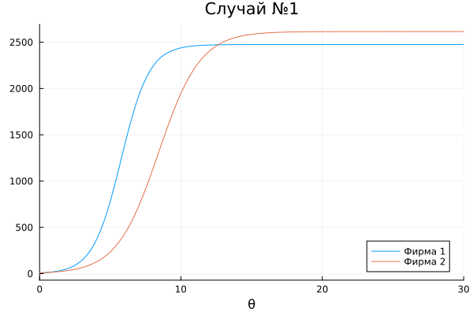
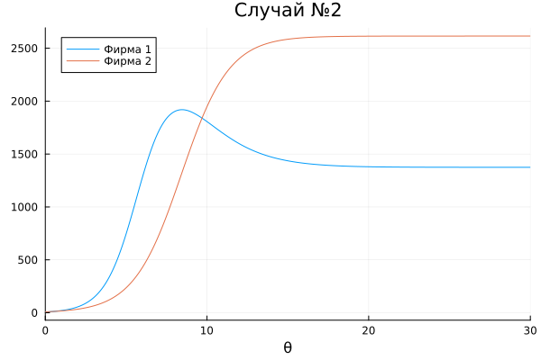

# Содержание {#содержание .TOC-Heading}

# Цель работы

Целью данной работы является исследование модели конкуренции между
друмая компаниями, где мы будем моделировать две ситуации на языке
программирование Julia.

# Задание

Постройте графики изменения оборотных средств фирмы 1 и фирмы 2 без
учета постоянных издержек и с веденной нормировкой для случая 1.

2.  Постройте графики изменения оборотных средств фирмы 1 и фирмы 2 без
    учета постоянных издержек и с веденной нормировкой для случая 2.

# Выполнение лабораторной работы

Случай 1. Рассмотрим две фирмы, производящие взаимозаменяемые товары
одинакового качества и находящиеся в одной рыночной нише. Считаем, что в
рамках нашей модели конкурентная борьба ведётся только рыночными
методами. То есть, конкуренты могут влиять на противника путем изменения
параметров своего производства: себестоимость, время цикла, но не могут
прямо вмешиваться в ситуацию на рынке («назначать» цену или влиять на
потребителей каким-либо иным способом.) Будем считать, что постоянные
издержки пренебрежимо малы, и в модели учитывать не будем. В этом случае
динамика изменения объемов продаж фирмы 1 и фирмы 2 описывается
следующей системой уравнений:

Случай 1

{ #fig:004 width=70% height=70% }

Случай 2. Рассмотрим модель, когда, помимо экономического фактора
влияния (изменение себестоимости, производственного цикла, использование
кредита и т.п.), используются еще и социально-психологические факторы --
формирование общественного предпочтения одного товара другому, не
зависимо от их качества и цены. В этом случае взаимодействие двух фирм
будет зависеть друг от друга, соответственно коэффициент перед M1 M2
будет отличаться. Пусть в рамках рассматриваемой модели динамика
изменения объемов продаж фирмы 1 и фирмы 2 описывается следующей
системой уравнений:

Случай 2

{ #fig:004 width=70% height=70% }

Обозначим: N -- число потребителей производимого продукта. S -- доходы
потребителей данного продукта. Считаем, что доходы всех потребителей
одинаковы. Это предположение справедливо, если речь идет об одной
рыночной нише, т.е. производимый продукт ориентирован на определенный
слой населения. M -- оборотные средства предприятия τ -- длительность
производственного цикла p -- рыночная цена товара p̃ -- себестоимость
продукта, то есть переменные издержки на производство единицы продукции.
δ -- доля оборотных средств, идущая на покрытие переменных издержек. κ
-- постоянные издержки, которые не зависят от количества выпускаемой
продукции.

## Условие задачи

Для обоих случаев рассмотрим задачу со следующими начальными условиями и

M1_0 = 8 #оборотные средства предприятия 1 M2_0 = 10 #оборотные средства
предприятия 2 p_cr = 50; #критическая стоимость продукта N = 50; #число
потребителей производимого продукта q = 1 #максимальная потребность
одного человека в продукте в единицу времени

# Параметры модели

tau1 = 36; #длительность производственного цикла фирмы 1 tau2 = 30;
#длительность производственного цикла фирмы 2 p1 = 10; #себестоимость
продукта у фирмы 1 p2 = 12; #себестоимость продукта у фирмы 2

# Код в Julia

## Случай 1

a1 = p_cr/(tau1tau1p1p1Nq); a2 = p_cr/(tau2tau2p2p2Nq); b =
p_cr/(tau1tau1tau2tau2p1p1p2p2Nq); c1 = (p_cr-p1)/(tau1p1); c2 =
(p_cr-p2)/(tau2\*p2);

function f1(du, u, p, t) du\[1\] = u\[1\] - (a1/c1)u\[1\]u\[1\] -
(b/c1)u\[1\]u\[2\]; du\[2\] = (c2/c1)u\[2\] - (a2/c1)u\[2\]u\[2\] -
(b/c1)u\[1\]\*u\[2\]; end

# Начальный момент времин

t = (0, 30)

Начальный вектор M0 = \[M1_0, M2_0\];

prob = ODEProblem(f1, M0, t)

sol = solve(prob)

plot(sol, label = \["фирмы 1" " фирмы 2"\], xlabel = "Время" , title = "
Случай 1");

# Второй случай

function f2(du, u, p, t) du\[1\] = u\[1\] - (a1/c1)u\[1\]u\[1\] -
(b/c1 + 0.00041)u\[1\]u\[2\]; du\[2\] = (c2/c1)u\[2\] -
(a2/c1)u\[2\]u\[2\] - (b/c1)u\[1\]\*u\[2\]; end

prob2 = ODEProblem(f2, M0, t)

sol2 = solve(prob2)

plot(sol2, label = \["фирмы 1" " фирмы 2"\], xlabel = "Время" , title =
" Случай 2")

## Решение

Первый случай (Julia)

{ #fig:004 width=70% height=70% }

Второй случай (Julia)

{ #fig:004 width=70% height=70% }

# Выводы

Тогда мы приходим к выводу, что обнаружили модели двух компании, мы
понимаем как работает модель в разных ситуациях и строим график
изменения данных биллинга в этих слувиях.

# Список литературы

1.  [Модель конкуренции двух фирм](https://esystem.rudn.ru/mod/resource/view.php?id=1100276)
